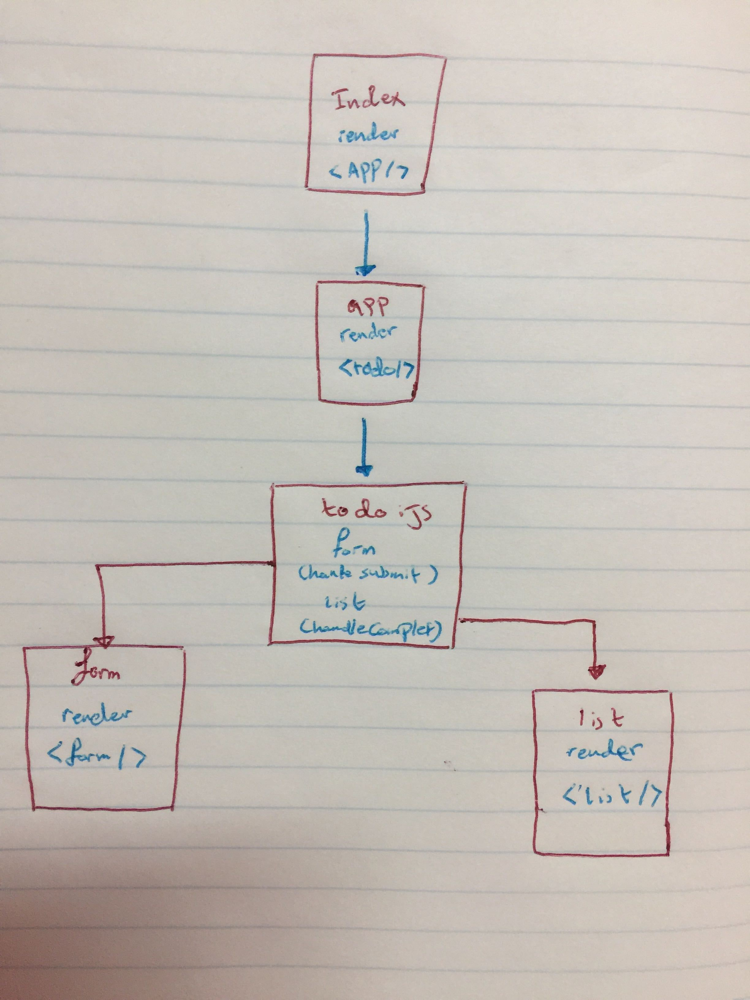

# todo

To Do List app using react 

### Author: Yasmin Adaileh :sunglasses:

### Links and Resources :paperclip:

### Documentation
- [Submission PR](https://github.com/yasmin-401-advanced-javascript/todo/pull/2)
- [Netlify](https://todo-context.netlify.app/)
## Library Used

In this app I used only the **react**

### Modules
- `header.js` 
- `main.js`
- `footer.js` 

### Packages
- `scss`

## Instruction How to Install the Library

1. `npx create-react-app resty-app` run it in the command line(Ubuntu)
1. `npm i  scss` run it in the command line(Ubuntu)

## How to run the app? :runner:

in the **Ubuntu** just type:
`npm start` run it in the command line(Ubuntu)

## UML

